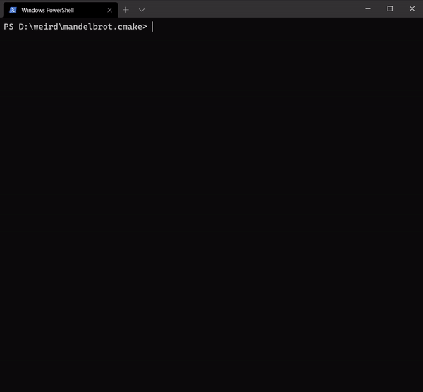
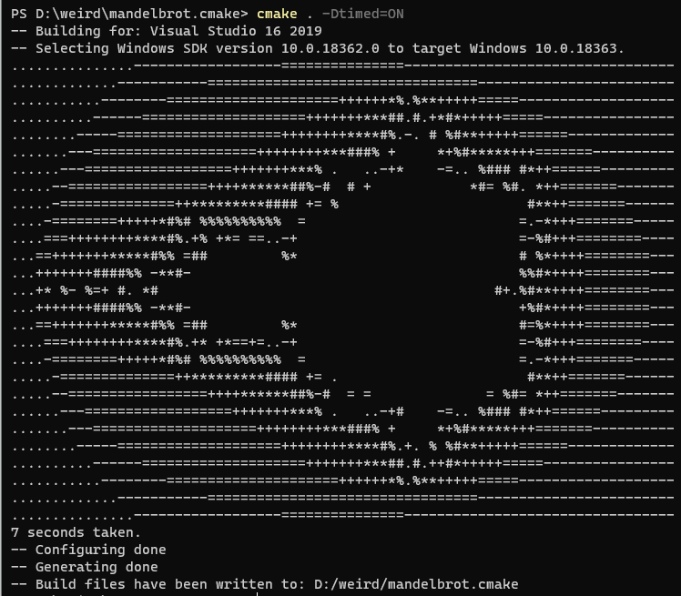

# CMake Mandelbrot set

A simple ASCII mandelbrot set fractal generator written in pure CMake.

I've got inspired as soon as see a [Ray Tracer made entirely in CMake](https://github.com/64/cmake-raytracer).

The first iteration of the program was written during my lunch break today, so keep your expectations low!

The program writes its output to stderr.

Arguments you can provide for the generator and its default values:

* `max_iter=100` *"infinite" iterations*
* `gradient=" .-=+*#%@"` *Output characters*
* `y_begin="-1.3"`
* `y_end="1.3"`
* `y_step="0.1"`
* `x_begin="-2.1"`
* `x_end="1.1"`
* `x_step="0.04"` 
* `timed=OFF` *Measures the time in seconds* 

# Output

